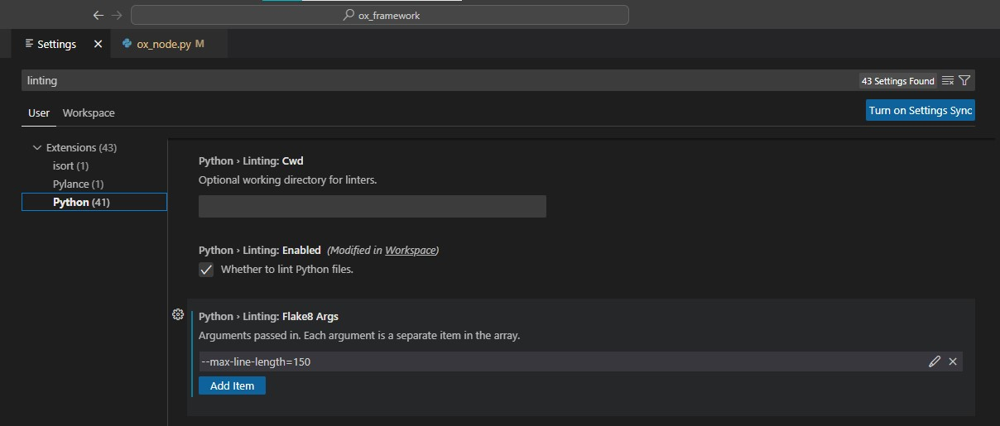

Appendix A: Coding Environment
==============================

VSCode IDE Setup
----------------

Black Installation and Configuration:
^^^^^^^^^^^^^^^^^^^^^^^^^^^^^^^^^^^^^

#. Install and configure Black Formatter: https://dev.to/adamlombard/how-to-use-the-black-python-code-formatter-in-vscode-3lo0
#. Set the line-length (This framework uses 150): https://dev.to/adamlombard/vscode-setting-line-lengths-in-the-black-python-code-formatter-1g62
#. Install Black for hython. You'll need to do this for auto-formatting to work when editing HDA scripts. See this video for how to install 3rd party libraries to hython: https://www.youtube.com/watch?v=cIEN50WuPoc

Configure the hou and ox Module for Auto-Complete
^^^^^^^^^^^^^^^^^^^^^^^^^^^^^^^^^^^^^^^^^^^^^^^^^

Add the following code to your settings.json file (I recommend doing this at the user level.) Don't know how to do that? Check this stack overflow:
https://stackoverflow.com/questions/65908987/how-can-i-open-visual-studio-codes-settings-json-file

.. code-block:: json

     {
          "python.autoComplete.extraPaths": [
               "C:/Program Files/Side Effects Software/Houdini 19.5.303/houdini/python3.9libs",
               "C:/Users/justi/source/repos/ox_framework/python3.9libs",
          ],
          "python.analysis.extraPaths": [
               "C:/Program Files/Side Effects Software/Houdini 19.5.303/houdini/python3.9libs",
               "C:/Users/justi/source/repos/ox_framework/python3.9libs"
          ],
          "python.autoComplete.preloadModules": [
               "hou",
               "ox"
          ]
     }

Make sure you adjust the paths above to wherever your Houdini installation lives and also the python3.xlibs path for the ox framework. 
Note: It was difficult to figure out how to get this to work and I couldn't find how from a single source. This may or may not work for you, but if 
it does not, search the internet for "houdini hou autocomplete VSCode" or equivalent. 

Flake8 Linter
^^^^^^^^^^^^^

Python linting in VSCode: https://code.visualstudio.com/docs/python/linting

You may use any linter you'd like, but if you are going to contribute to the framework, I will be enforcing a clean result from Flake8. The Setup can
be found in the root of the directory as "setup.cfg"

When modifying toolbar scripts, the setup.cfg file may be ignored as it was for me. In this case, you can add command line arguments for flake8 in the
settings. Go to File>Preferences>Settings and type in linting. Then click on "Python" on the left under "Extensions" as seen in the image below. Add
as many options as you need. For now this example just has --max-line-length=150.

The nodes folders are excluded for now, but most of that is auto-generated and will not be modified directly. 

PyCharm IDE Setup
-----------------

PyCharm is a great IDE. I never figured out how to get the hou module to work with it, unfortunately. 
Please consider contributing if you have been able to get this to work with Pycharm. 

Learning Resources
------------------

* Python Logging: https://realpython.com/python-logging/

Houdini HOM
^^^^^^^^^^^

SideFX HOM Documentation: https://www.sidefx.com/docs/houdini/hom/intro.html

Recommended beginner Houdini Automation Tutorial: Intro to Python in Houdini by Socratica FX:

.. raw:: html
    
     <iframe width="560" height="315" src="https://www.youtube.com/embed/59vetivUGes" title="YouTube video player" frameborder="0" allow="accelerometer; autoplay; clipboard-write; encrypted-media; gyroscope; picture-in-picture" allowfullscreen></iframe>

