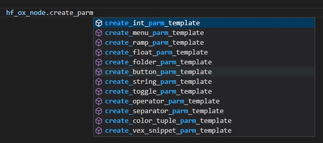

.. image:: images/index/under_construction.jpg
    
Working with Parm Templates
===========================

Creating Parm Templates
-----------------------

Adding a new parameter to a node can be a complicated matter depending on what you are trying to do. This is mainly a two-step process of 1. creating 
the parm template and 2. Adding that parm template to the node you want (and in the right place.)

All OX nodes have direct access to creating (almost) any type of parm template you would need. Adding the remaining parm templates is a matter of 
priority, but should not take long. The reason we are including these in the framework is for autocompletion and to have a much simpler way to add
the parm templates where you want them. 

Each of the parm template create methods returns a parm template. The reason we don't add the parm template in the same method is that the logic
can be convoluted and would require a multitude of parameters to be repeated per create method. 

Adding Parm Templates
---------------------

To add a parm template, simply call the add_parm_template method like so:

.. code-block:: python

    new_parm_template = some_ox_node.create_int_parm_template(name='some_parm')
    some_ox_node.add_parm_template(parm_template=new_parm_template, insert_after_parm='<name_of_parm_to_inser_after | parm>')

Keep in mind there are more strategies available to inserting parm templates. See the method signature for more methods. 

Removing Parm Templates
-----------------------

Removing parm templates is simple:

.. code-block:: python

    some_ox_node.remove_parm_template_by_name(name='some_parm_name')

Folders are more difficult as their names are not controlled by our code. In this case, use the following:

.. code-block:: python

    some_ox_node.remove_folder_by_label(label='My Folder Label')

Subfolders are a special case. You'll need to provide the parent and child folder labels. 

.. code-block:: python

    some_ox_node.remove_subfolder_by_labels(parent_folder_label='My Parent Folder Label', folder_label='My Folder Label')
