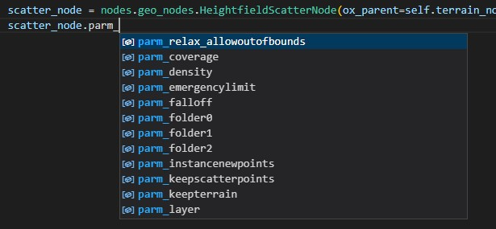

.. OX HOM Framework documentation master file, created by
   sphinx-quickstart on Tue Nov  1 12:23:38 2022.
   You can adapt this file completely to your liking, but it should at least
   contain the root `toctree` directive.

.. image:: images/index/under_construction.jpg

Welcome 
=======

Welcome to OX HOM Framework for Houdini documentation!

The OX HOM Framework is an abstraction layer framework build on top of Houdini's HOM API. 
This framework makes it easy to organize many low-level steps into simple, high-level rerunnable functions such as the following:

* connecting nodes together by input and output labels (with auto complete for those labels)
* Easy adding and deleting parm templates from nodes
* Setting menu parm values by label (with auto complete)
* Search for child nodes by substring or regex (returns a list of nodes)
* Handling saving and loading of presets
* Simple logging system for helpful debugging (no print statements needed!)

   * Easily change logging level from child

* Easily extendible framework. 
* And many more helpful functions. 

The following is an example of how we can call a method on any node that can run any code and leverage the HOM in a
way that requires the least amount of boilerplate code. 

.. image:: images/index/abstract_code_example.png
   :width: 1125

Another main feature of the framework is providing quality-of-life coding environament capabilities such as auto-complete
for all nodes and parameter

This OOP class structure is posible through automatic class generation (and member registration) and require very little additional setup per node. 
